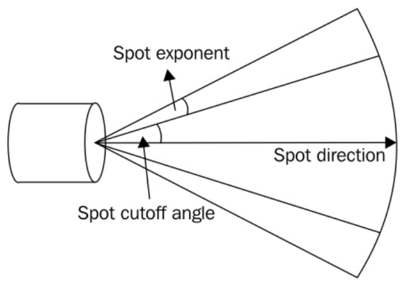

# Report of Coursework 3

## Main requirements and Achievements

The main requirements of this course work contains the following key points:

Tools:

- Use of `qmake` build toolchain.
- C++ language and use and configuration of C++ compiler

Libraries:

- OpenGL ES languages and OpenGL APIs
- OpenGL’s programmable rendering pipeline

My achievement of the coursework contains the implementation of 

- Basic transformation matrices, including 
  - Rigid transformation matrices (Rotation & translation), scaling matrix, frustum matrix that can transform the model, or transform from world coordinate to view coordinate. 
  - Projection matrix, including orthogonal and perspective projection matrices.
- Camera, and interaction with camera, including
  - handle mouse & keyboard events, and to handle window resizement
  - Construction of  view matrix and projection matrix from yar & pitch parameter or front, up vectors
- Light, including 
  - Different light types point light, parallel (directional) light and spotlight. This part will be introduced in the following sections.
  - Lighting model, especially Blinn-Phong lighting model.
  - Management of multiple lights
- Introduction of third-party GUI libraries. ImGUI.

## Implementation Keypoints

### OpenGL API

OpenGL is a status machine, we must switch between different status. Data is uploaded from client (CPU side) to server (GPU side) by calling OpenGL methods and can be retrieved from server.

### Mesh

- A generated sphere mesh with normals, texture coordinates (for further use), and colors

  ```c++
  void CreateSphere(unsigned int iLongitude, unsigned int iLatitude,
                    Mesh& oMesh) {
    const float PI = 3.1415926535897f;
  
    oMesh.Clear();
  
    unsigned int n = (iLatitude + 1) * iLongitude;
    oMesh.size = n;
  
    oMesh.data.reserve(11 * n);
    oMesh.indices.reserve(6 * iLongitude * iLatitude);
  
    // positions, normals, texcoord, color
    // index
  
    for (unsigned int i = 0; i <= iLatitude; i++) {
      float y = std::cos(i * PI / iLatitude);
  
      for (unsigned int j = 0; j < iLongitude; j++) {
        float x = static_cast<float>(std::sin(i * PI / iLatitude) *
                                     std::sin(2 * j * PI / iLongitude));
        float z = static_cast<float>(std::sin(i * PI / iLatitude) *
                                     std::cos(2 * j * PI / iLongitude));
        // positions
        oMesh.data.push_back(x);
        oMesh.data.push_back(y);
        oMesh.data.push_back(z);
  
        // normals
        oMesh.data.push_back(x);
        oMesh.data.push_back(y);
        oMesh.data.push_back(z);
  
        // texcoord
        oMesh.data.push_back(static_cast<float>(i) /
                             static_cast<float>(iLatitude));
        oMesh.data.push_back(static_cast<float>(j) /
                             static_cast<float>(iLongitude));
  
        // color
        oMesh.data.push_back((x + 1.0f) / 2.0f);
        oMesh.data.push_back((y + 1.0f) / 2.0f);
        oMesh.data.push_back((z + 1.0f) / 2.0f);
      }
    }
  
    // index
    for (unsigned int i = 0; i < iLatitude; i++) {
      for (unsigned int j = 0; j < iLongitude; j++) {
        auto p1 = iLongitude * i + j;
        auto p2 = iLongitude * (i + 1) + j;
        auto p3 = iLongitude * (i + 1) + j + 1;
        auto p4 = iLongitude * i + j + 1;
  
        p1 = p1 % n;
        p2 = p2 % n;
        p3 = p3 % n;
        p4 = p4 % n;
  
        oMesh.indices.push_back(p4);
        oMesh.indices.push_back(p1);
        oMesh.indices.push_back(p2);
        oMesh.indices.push_back(p4);
        oMesh.indices.push_back(p2);
        oMesh.indices.push_back(p3);
      }
    }
  }
  ```


Image: sphere of 10 segments


Image: sphere of 30 segments


Image: sphere of 70 segments

Vertices information is defined by Vertex Array Object (VAO) and the data is stored in Vertex Buffer Object (VBO), sometimes an array of indices are needed to define how the vertices are organized to triangular patches, in this situation, EBO is also needed.

> Position (Vec3f) - 12 Bytes,  Normal (Vec3f) - 12 Bytes, Texture coordinates (Vec2f) - 8 Bytes, Color (Vec3f) - 12 Bytes

In our program, Qt wrapped OpenGL interfaces are adopted:

`QtOpenGLShader`: equivalent to 

```c++
  _name = glCreateShader(iType);

  glShaderSource(_name, 1, file_content, NULL);
  glCompileShader(_name);

  glGetShaderiv(_name, GL_COMPILE_STATUS, &_status);
```

`QtOpenGLShaderProgram`: equivalent to

```c++
  for (const auto &shader : _shaders)
  {
    auto id = shader->GetShaderName();
    glAttachShader(_name, id);
  }

  glLinkProgram(_name);
  OGL_CHECKPOINT_ALWAYS();
  glGetProgramiv(_name, GL_LINK_STATUS, &_status);
```

`bind`/`release`/`SetUniform` methods are equivalent to

```c++
glBind*();
glBind*(..., 0);

glUniform*(glGetUniformLocation(...),...)
```

respectively.

### Material

Material defines the physical properties of a surface, especially how it reacts to lights,.Basically it contains the following components:

- Diffuse: light ray comes from a light source and hit directly a surface.
- Ambient: all the vertex of the scene are affected by this component.
- Specular: is the light component that create highlight on surfaces like mirror and metal.
- Shininess: The strength of specular effect.
- Emission: some objects like lamp, LED ... can emits light. Emission is used to creates this kind of objects

Emission is not considered in our program. But we considered constant and texture support for material definition.

```c++
  Vec3f ambient;
  Vec3f diffuse;
  Vec3f specular;
  float shininess; 
```


Image: Lower shininess


Image: Higher shininess


Image: Lower specular


Image: Different diffuse


Image: Lower Ambient

### Lights

There are 3 kind of lights considered:

1. Directional light, for example, the sun rays. It has uniform direction and strength

   ```c++
   struct directionalLight {
     vec3 direction;
     vec3 ambient;
     vec3 diffuse;
     vec3 specular;
   };
   ```

   

2. Point light, for example, a bulb. It has a position and the light goes away from the origin. The strength is in inverse ratio to the distance of the target position to the light source: $E=\dfrac{1}{d}$.

   ```c++
   struct pointLight {
     vec3 position;
     vec3 ambient;
     vec3 diffuse;
     vec3 specular;
   
     float constant;
     float linear;
     float quadratic;
   };
   ```

   Note that we’re using Phong lighting model:

   - the last 3 floats defines the attenuation factor: $1/a=\texttt{constant}+\texttt{linear}\times d+\texttt{quadratic} \times d^2$

   - ambient color: $\texttt{lignt.ambient}\times \texttt{material.ambient}$

   - diffuse color: $\dfrac{kI}{a}\max(0, n\cdot L)$ where L points from the fragment to the viewer, $I$ is the original strength of the light (the image shows how it changes as $k$ increases)

     

   - specular color: $\dfrac{kI}{a}\max(0,n\cdot h)^p$, where $h$ in Blinn-Phong model is the half vector $h=\dfrac{L+l}{||L+l||}$, $l$ points from the fragment to the light. In Phong model, $L_s=\dfrac{kI}{a}\max(0,l\cdot r)^p$, where $r$ is the reflected light ray's direction.

   

​		Image: rendering with only ambient component


​		Image: rendering with ambient and diffuse component


​		Image: final light effect

3. Spot light:: it has both position and direction

   ```c++
   struct SpotLight｛
     Vec4f position;
     Vec4f direction;
     Vec4f ambient;
     Vec4f diffuse;
     Vec4f specular;
   
     float constant;
     float linear;
     float quadratic;
   
     float cutOff;
     float outerCutOff;
   ｝;
   ```

   </img>

   

   Image: sphere under multiple light (including three kind of light sources, Phong model)

### Camera


Some transform need to be done to cast world coordinates into $[-1,1]^3$, which is camera space, the perspective matrix is calculated to be 

$P=\begin{bmatrix}\dfrac{n}{r}&0&0&0\\0&\dfrac{n}{t}&0&0\\0&0&-\dfrac{f+n}{f-n}&-\dfrac{2fn}{f-n}\\0&0&-1&0\end{bmatrix}$

And the orthogonal projection matrix is to be

$P=\begin{bmatrix}\dfrac{1}{r}&0&0&0\\0&\dfrac{1}{t}&0&0\\0&0&-\dfrac{2}{f-n}&-\dfrac{f+n}{f-n}\\0&0&0&1\end{bmatrix}$

If a point is in world coordinates $x$, then the final position should be $PVx$, where $V$ for view matrix, which is calculated by the rigid transform of camera from the origin.

`Qt` 's Matrix and Vector modules are adopted to construct such matrices.

## Results


## Debates

### Topic 1: Phong shading and smoothing shading

In Phong shading, lights, camera, normal vectors are all considered and interpolated (see the sections above for details), the superposition of ambient, diffuse, specular lights with shininess parameter makes the coloring much more realistic. In this process, matrix operations are need to compute the transformed normal vectors and positions.

But with smoothing shading, only color attributes are interpolated, no matter how many lights are appended to the scene, or from where the observer is watching, the shading won't change.

Also, we can deduce that Phong shading costs more than the smoothing shading. 

### Topic 2: VBO and glVertex

In compatible mode, OpenGL uses interfaces like `glVertex` and `glMatrix` to draw, but in OpenGL ES, programmable pipelines are introduced. Here are the most noticeable differences:

- Every time we call `glVertex`, the data is sent from the client (CPU) side to the server (GPU) side, but with `VBO`, the data is sent at the same time and is buffered in video memory, hence reduces extra cost (especially data exchange cost) a lot. Also users can call API like `glBufferSubData` to update part of the buffer data at the same time. Moreover, with programmable pipeline, the usage of buffer objects is broaden, other kind of attributes can also be stored in a buffer, for example.

### Topic 3: VBO and index array

- Apparently, the adoption of EBO (index array) can reduce the number of vertices - vertices can be retrieved by indices
- But at the same time, accessing vertices by subscriptions will cost more than reading in order.

